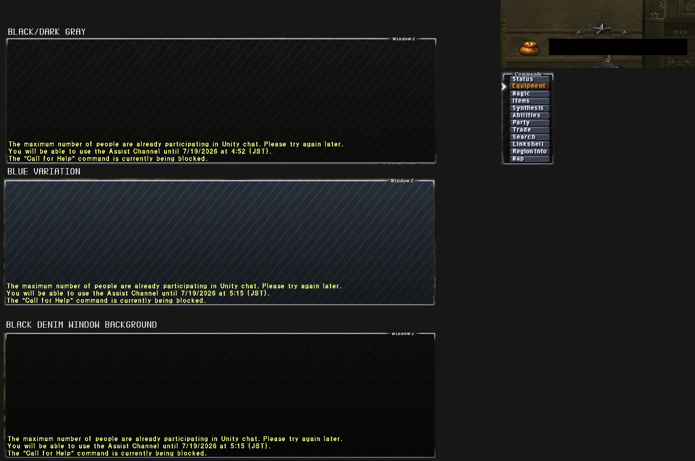

# FFXI-UI
FFXI UI Enhancements

Currently being used as a repository for small additions made for use with another UI pack. If a full release is ever made it will replace this section or be a subsection therein.

Currently, To install, take the files and place them into your game directory FinalFantasyXI/ROM/0

Doing so will add the three different themes to window(s) #2, #4, and #6 when switching in-game via the 'Windows' tab under CONFIG/WINDOWS/SHARED.

